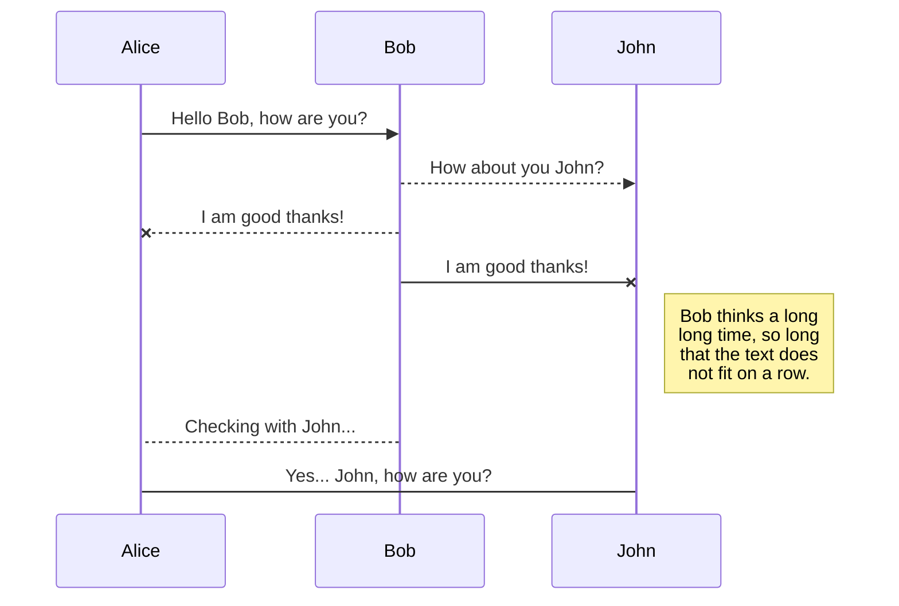
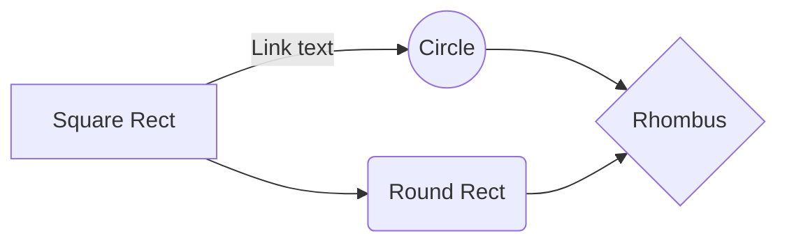

#                Manual de uso Basico de Git 

**Índice**   
1. [Clonar repositorio](#id1)
2. [Subir un cambio con Git](#id2)
3. [Como Hacer un Merge](#id3)
4. [Como subir los cambios a un repositorio en la nube](#id4)

En este manual encontraran los aspectos basicos para iniciar el uso de Git

## Clonar repositorio

+ **Paso 1**

Se necesita la URL del repositorio que se desea clonar

+ **Paso 2**

Creamos una carpeta que será donde copiará el repositorio 

+ **Paso 3** 
Copiamos la URL donde está alojado el repositorio

               En ejemplo será uno  en Github

+ **Paso 4**

Damos Clic derecho en la carpeta creada y seleccionamos la opción **Git Bash Here**

Nos abrirá el editor de Git 

+ **Paso  5**

Usamos el comando:

**Git clone** y la URL del repositorio

Cargara la información del repositorio

+ **Paso 6**
En la carpeta creada veremos los archivos descargados localmente del repositorio

De esta forma quedaran los archivos guardados localmente para hacer uso de ellos.

## Subir un cambio con Git

+ **Paso 1**
Abrimos el proyecto 

Iniciamos el proyecto con

 **Git init**

+ **Paso 2**

Realizamos los cambios o modificaciones en el proyecto

Al visualizar el explorador de soluciones tenemos cambios que no se han agregado

+ **Paso 3**

Usamos el comando **git status**

Para validar que elementos nuevos encuentra 

Se veran resaltados en rojo las modificaciones o archivos nuevos que encuentra pero no se han guardado.

+ **Paso 4**

Agregamos los archivos para subir repositorio con el comando **git add -A**

Usamos el comando **git status**

Se veran reflejados los cambios listos para agregarlos al repositorio.

+ **Paso 5**

Para subir los cambios usaremos el comados **git commit -m "Descripción"**

En la descripción debemos especificar que cambios se estan subiendo

Validaremos en el explorador de soluciones que el cambio se realizo correctamente 

De esta forma tendremos el cambio o modificación guardado en el repositorio localmente.

## Como Hacer un Merge

+ **Paso 1**

Iniciamos el proyecto usando el comando **git init**

+ **Paso 2**

Debemos crear una rama que será donde realicemos los cambios para luego realizar el merge a la rama principal llamada **Master**

Usamos el comando **git branch "nombre"**

+ **Paso 3**

Despues de crear la nueva rama, vamos a posicionarnos en ella

Usamos el comando **git checkout "nombre de la rama"**

En la ruta veremos que estamos en la rama **pruebamerge** o usamos el comando **git branch**

En verde nos resaltara la rama donde estamos posicionados.

+ **Paso 4**

Una vez hecho esto procedemos a realizar nuestros cambios o modificaciones en algún archivo del repositorio o crear uno nuevo.

+ **Paso 5**

Con los cambios realizados los alistaremos para agregarlos al repositorio

Usamos el comando **git add -A**

A continuación cargaremos los cambios al repositorio en la rama creada

Usamos el comando **git commit -m "Descripción"**

Despues de haber realizado el commit, volveremos a la rama **Master** para unificar los cambios

+ **Paso 6**

Usamos el comando **git checkout master** para volver a la rama principal

Estando en la rama principal usamos el comado **git merge pruebamerge** para realizar la union.

veremos los cambios guardados en la rama principal.

## Como subir los cambios a un repositorio en la nube

Debemos tener un repositorio en la nube donde haremos el push 

+ **Paso 1**

Iniciar el proyecto

Usamos el comandos **Git init**

+ **Paso 2**

Debemos tener commits realizados

Para subir los cambios, primero debemo crear una conexión con el repositorio

Usamos el comandos **git remote add origin https://github.com/juansanchez9618/Prueba-TP.git**

Es necesario la URL donde esta esta el repositorio en la nube, en este ejemplo utilizaremos uno de prueba

+ **Paso 3**

Ya tenemos la union al repositorio, ahora solicitaremos subir los cambios a dicho repositorio.

Usamos el comandos **git push -u origin master**

La primera vez nos solicitara las credenciales del repositorio.

Despues de confirmar las credenciales empezara a subir la información al repositorio.

Una vez finalice podemos validar en github o donde tengamos el repositorio que ya estan los cambios.

+ **Paso 4**

Ya como tenemos la conexión del repositorio local con github cuando tengamos cambios que subir.

Usamos el comando **git push**

____________________

## Create files and folders

The file explorer is accessible using the button in left corner of the navigation bar. You can create a new file by clicking the **New file** button in the file explorer. You can also create folders by clicking the **New folder** button.
	
## Switch to another file

All your files and folders are presented as a tree in the file explorer. You can switch from one to another by clicking a file in the tree.

## Rename a file

You can rename the current file by clicking the file name in the navigation bar or by clicking the **Rename** button in the file explorer.

## Delete a file

You can delete the current file by clicking the **Remove** button in the file explorer. The file will be moved into the **Trash** folder and automatically deleted after 7 days of inactivity.

## Export a file

You can export the current file by clicking **Export to disk** in the menu. You can choose to export the file as plain Markdown, as HTML using a Handlebars template or as a PDF.

# Synchronization

Synchronization is one of the biggest features of StackEdit. It enables you to synchronize any file in your workspace with other files stored in your **Google Drive**, your **Dropbox** and your **GitHub** accounts. This allows you to keep writing on other devices, collaborate with people you share the file with, integrate easily into your workflow... The synchronization mechanism takes place every minute in the background, downloading, merging, and uploading file modifications.

There are two types of synchronization and they can complement each other:

- The workspace synchronization will sync all your files, folders and settings automatically. This will allow you to fetch your workspace on any other device.
	> To start syncing your workspace, just sign in with Google in the menu.

- The file synchronization will keep one file of the workspace synced with one or multiple files in **Google Drive**, **Dropbox** or **GitHub**.
	> Before starting to sync files, you must link an account in the **Synchronize** sub-menu.

## Open a file

You can open a file from **Google Drive**, **Dropbox** or **GitHub** by opening the **Synchronize** sub-menu and clicking **Open from**. Once opened in the workspace, any modification in the file will be automatically synced.

## Save a file

You can save any file of the workspace to **Google Drive**, **Dropbox** or **GitHub** by opening the **Synchronize** sub-menu and clicking **Save on**. Even if a file in the workspace is already synced, you can save it to another location. StackEdit can sync one file with multiple locations and accounts.

## Synchronize a file

Once your file is linked to a synchronized location, StackEdit will periodically synchronize it by downloading/uploading any modification. A merge will be performed if necessary and conflicts will be resolved.

If you just have modified your file and you want to force syncing, click the **Synchronize now** button in the navigation bar.

> **Note:** The **Synchronize now** button is disabled if you have no file to synchronize.

## Manage file synchronization

Since one file can be synced with multiple locations, you can list and manage synchronized locations by clicking **File synchronization** in the **Synchronize** sub-menu. This allows you to list and remove synchronized locations that are linked to your file.

# Publication

Publishing in StackEdit makes it simple for you to publish online your files. Once you're happy with a file, you can publish it to different hosting platforms like **Blogger**, **Dropbox**, **Gist**, **GitHub**, **Google Drive**, **WordPress** and **Zendesk**. With [Handlebars templates](http://handlebarsjs.com/), you have full control over what you export.

> Before starting to publish, you must link an account in the **Publish** sub-menu.

## Publish a File

You can publish your file by opening the **Publish** sub-menu and by clicking **Publish to**. For some locations, you can choose between the following formats:

- Markdown: publish the Markdown text on a website that can interpret it (**GitHub** for instance),
- HTML: publish the file converted to HTML via a Handlebars template (on a blog for example).

## Update a publication

After publishing, StackEdit keeps your file linked to that publication which makes it easy for you to re-publish it. Once you have modified your file and you want to update your publication, click on the **Publish now** button in the navigation bar.

> **Note:** The **Publish now** button is disabled if your file has not been published yet.

## Manage file publication

Since one file can be published to multiple locations, you can list and manage publish locations by clicking **File publication** in the **Publish** sub-menu. This allows you to list and remove publication locations that are linked to your file.

# Markdown extensions

StackEdit extends the standard Markdown syntax by adding extra **Markdown extensions**, providing you with some nice features.

> **ProTip:** You can disable any **Markdown extension** in the **File properties** dialog.

## SmartyPants

SmartyPants converts ASCII punctuation characters into "smart" typographic punctuation HTML entities. For example:

|                |ASCII                          |HTML                         |
|----------------|-------------------------------|-----------------------------|
|Single backticks|`'Isn't this fun?'`            |'Isn't this fun?'            |
|Quotes          |`"Isn't this fun?"`            |"Isn't this fun?"            |
|Dashes          |`-- is en-dash, --- is em-dash`|-- is en-dash, --- is em-dash|

## KaTeX

You can render LaTeX mathematical expressions using [KaTeX](https://khan.github.io/KaTeX/):

The *Gamma function* satisfying $\Gamma(n) = (n-1)!\quad\forall n\in\mathbb N$ is via the Euler integral

$$
\Gamma(z) = \int_0^\infty t^{z-1}e^{-t}dt\,.
$$

> You can find more information about **LaTeX** mathematical expressions [here](http://meta.math.stackexchange.com/questions/5020/mathjax-basic-tutorial-and-quick-reference).

## UML diagrams

You can render UML diagrams using [Mermaid](https://mermaidjs.github.io/). For example, this will produce a sequence diagram:

And this will produce a flow chart:

<!--stackedit_data:
<<<<<<< HEAD
eyJoaXN0b3J5IjpbMTEyNTU2MTA4NSw1NDQ3NzA1LC0yNTY5NT
QyNjVdfQ==
=======
eyJoaXN0b3J5IjpbOTc4MjgwNzEwLDMwMzg4MzY1NCwxMTI1NT
YxMDg1LDU0NDc3MDUsLTI1Njk1NDI2NV19
>>>>>>> e27c6874f66784937322c3ddfb633f06488a91c2
-->
<!--stackedit_data:
eyJoaXN0b3J5IjpbNDQ0MDM1MDU4LC01NzgzNjkwODldfQ==
-->